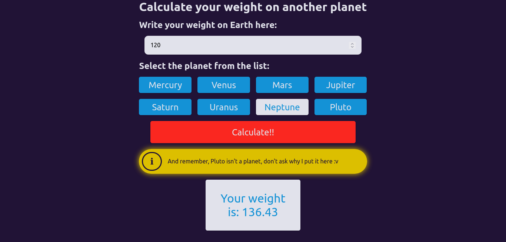
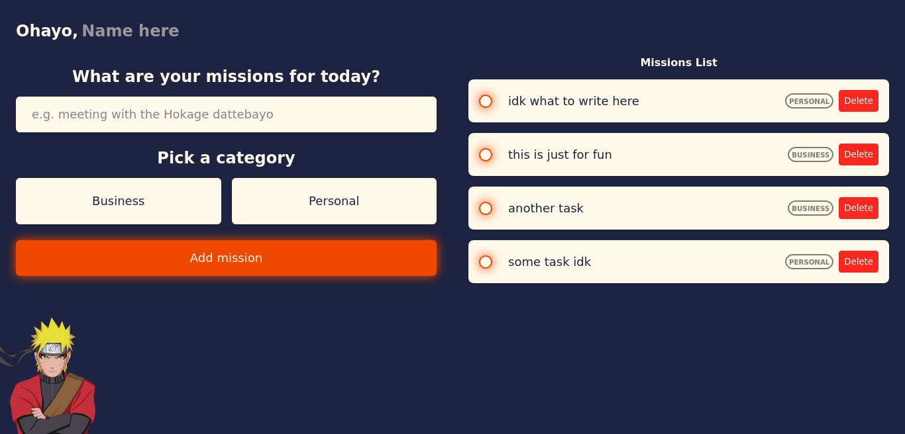
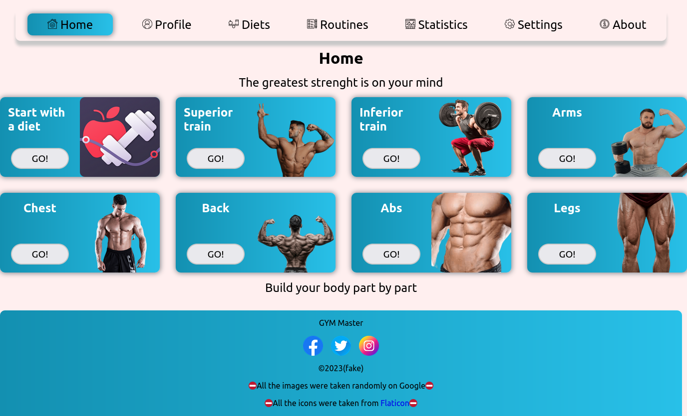

<h1 align="center">Hi, I'm Cesar</h1>
<h2 allign="center">Welcome to my presentation page</h2>

### I'm a web developer. At this time I only know front-end technologies, but I still learning.

## Here are some of my current skills:

- HTML
- CSS
- JavaScript
- Vue.js
- Vite
- Sass
- Git & GitHub

## I make small projects to practice, down here are some screenshoots

[Heavy Planets](https://github.com/CesarSullen/heavy-planets)

[Shinobi Tasks](https://github.com/CesarSullen/shinobi-tasks/)

[Guessing Game](https://github.com/CesarSullen/guessing-game/)

[GYM Master](https://github.com/CesarSullen/gym-master/)
