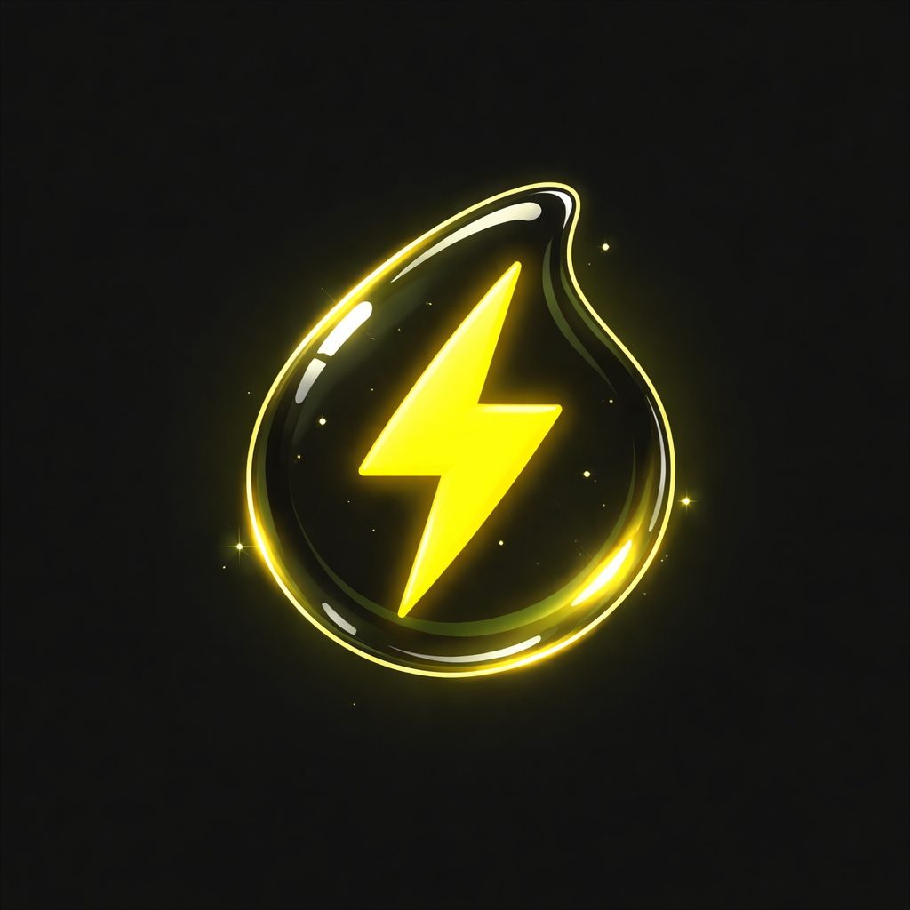
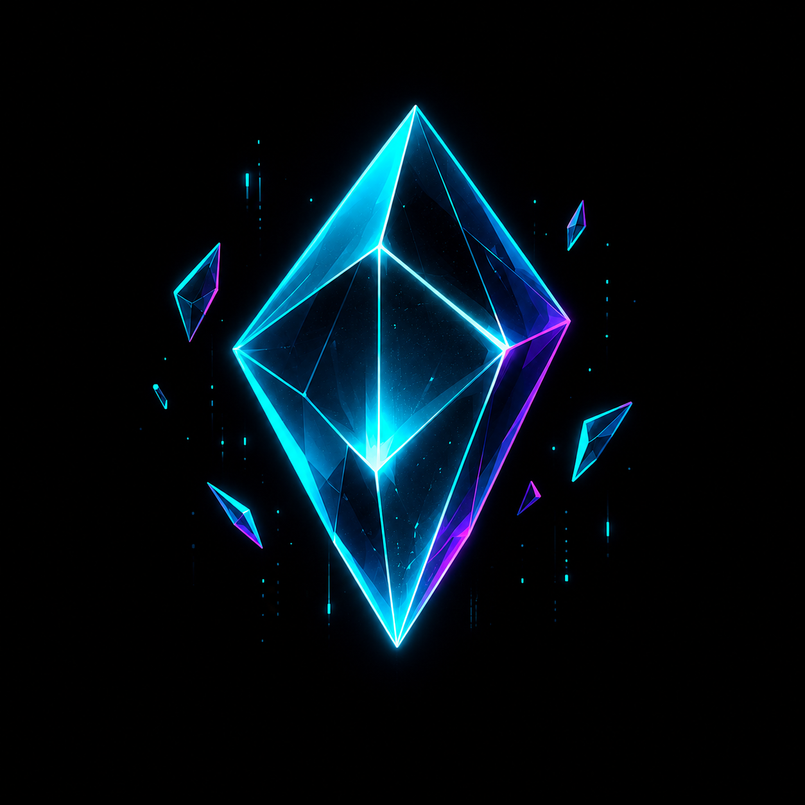

<p align="center">
  
</p>

<h1 align="center">Saru</h1>

<h3 align="center">
Full Stack Developer
</h3>

<p align="center">
Building modern web applications with clean code, great UX and some coffee.
</p>

<p align="center">
<a href="https://cesarsullen.github.io/links">

</a>
</p>

---

# 🌙 About Me

```ts
const saru = {
	role: "Full Stack Developer",
	location: "Cuba",

	experience: {
		years: 4,
		focus: "Modern web applications",
	},

	stack: {
		frontend: ["TypeScript", "HTML", "SCSS"],
		backend: ["Deno"],
		database: ["PostgreSQL", "SQLite"],
	},

	currently: "Building personal projects.",

	motto: "Keep it simple.",
};
```

---

# ⚡ Tech Stack

### Frontend

<p>

</p>

### Backend

<p>

</p>

### Database

<p>

</p>

### Tools

<p>

</p>

---

# 🚀 Featured Projects

|                                           Stox                                            |                                                Radiocast                                                 |
| :---------------------------------------------------------------------------------------: | :------------------------------------------------------------------------------------------------------: |
| <a href="https://cesarsullen.github.io/stox"></a> | <a href="https://cesarsullen.github.io/radiocast"></a> |
|                                     Stock management.                                     |                                               Lo-Fi radio.                                               |

|                                           Kuic                                            |                                             Greed0                                              |
| :---------------------------------------------------------------------------------------: | :---------------------------------------------------------------------------------------------: |
| <a href="https://cesarsullen.github.io/kuic"></a> | <a href="https://cesarsullen.github.io/greed0"></a> |
|                                        To-Do App.                                         |                                        Simple Schedule.                                         |

---

# 🌱 Now

- 🚧 Building personal projects
- 📚 Learning more about backend
- 🎨 Improving UI/UX skills

---

# 💻 Terminal

```console
saru@github:~$ whoami

> Full Stack Developer
> TypeScript Enthusiast
> Deno Enjoyer
> Building useful web applications.

saru@github:~$
```

---

<p align="center">

</p>

<p align="center">
<i>Keep it simple.</i>
</p>
